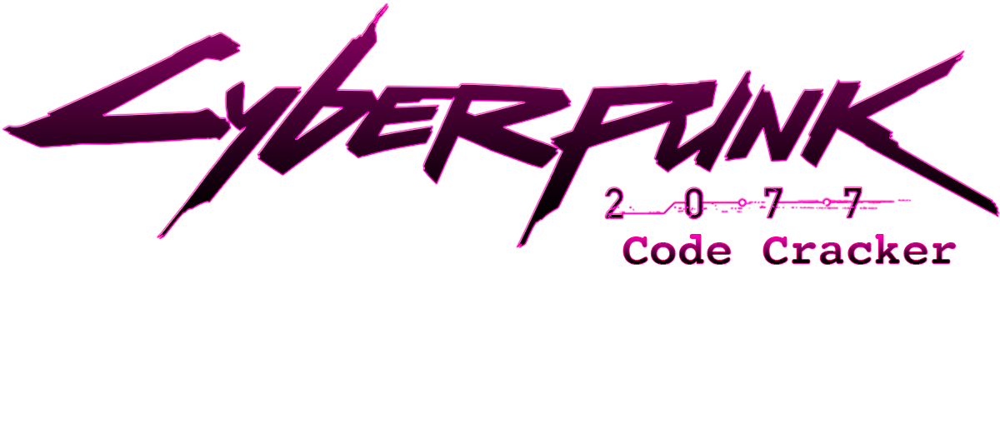
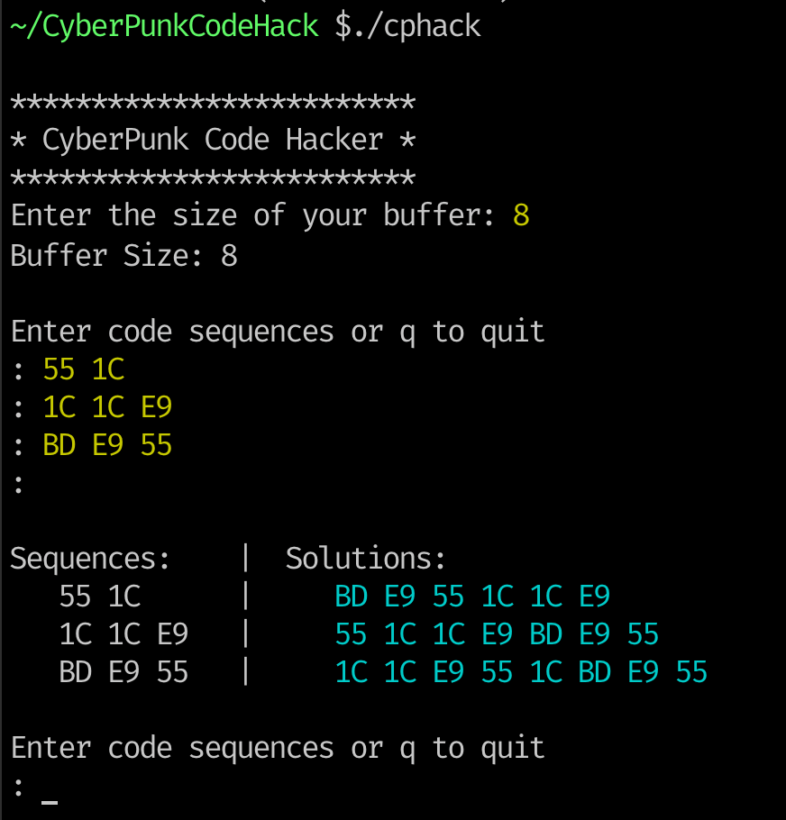

# CyberPunk Code Cracker

This little program will help you solve the in game code hacking (breeching) puzzles. These puzzles that they put in the game are interesting and among the most complicated that I've ever seen in a game (but I don't game all that often).

This program will be run from within a terminal or a command prompt in Windows.

### Installation
This program runs on Linux, MacOS, or Windows (tested on Windows 11). **IT WILL NOT WORK ON SMARTPHONES!**

Installation is easy. Simply download the executable for your operating system [from here](https://github.com/EasyG0ing1/CyberPunkCodeHack/releases) and place it into a folder that is somewhere on your PATH. OR, just make a folder for it and put it in there, but every time you run it, you will need to CD into that folder first.

### Why use this program?
That's easy, this program will always give you the solution that includes all three sequences without failing. If there is no solution for all three sequences (and this will be determined by the size of your buffer), then it will just tell you that there are no solutions. But it's always nice to know so that you don't waste your time trying to figure out the solution for all three sequences.

If there is no solution for all three sequences, then you need to try to manually figure it out for yourself or just pick a single sequence and enter it in, because the program does not currently check subsets of sequences. However, no solution scenarios will be the exception and not the norm. You can increase your chances of getting all three by going to a ripper doc and upgrading your operating system. Buffer size is the attribute you're looking to increase for this purpose, but I recommend getting as much base RAM, Buffer Size and Slots as you can afford.

### How to use the program
The concept is very simple. You first enter in the size of your buffer, then you enter in each required sequence and the program will give you all possible solutions for the sequences you gave it. Then you simply figure out which solution actually works from the Code Matrix it gives you.

Most of the time, it will only give you one solution. The larger your buffer is, the more likely it will give you multiple solutions. However, it's really easy to figure out which solution will work.

Lets break it down...

We'll use this example and go through the com.simtechdata.process:

Taking the noted areas of the screen, this is what it would look like when you run the program

So you take the size of your buffer and enter it in first (subsequent uses of the program will give you the option of just hitting enter because it remembers the last value that you gave it).

Then you just ype each sequence on a line separating the values with a space and hit enter. Then hit enter on a blank line to start the cracking.

You can see from this example, that it found three solutions that could work. So the com.simtechdata.process of finding which solution you can enter is a matter of following the rules of the code matrix.

The rules of the code matrix are simple. You **ALWAYS** start with the **TOP ROW** and select a value. After that, you follow the pattern of selecting your next value from the **COLUMN** that your first value is in. Then select your next value from the **ROW** that number is in... the pattern repeats: column, row, column, row etc...

So lets look at the first solution it gave us: **55 1C 1C E9 BD E9 55**

Since the top row only has one **55** then we start there and we try to find the rest of the numbers following the rule pattern. Since the second number is **1C** we have two choices for the next value to select, but being mindful of the number following that one, you will want to look at the rows of those two options to see if the third number is there in that row, and in both cases here, the thrid number which is also **1C** exists in both rows, so we will start with the first **1C* in the column and follow that out...

To simplify, here are the possible options to follow for the first solution:

So when we exhaust all possible implementations of the first solution using the rules for the code matrix, we run into a dead end every time.

The second solution: **1C 1C E9 55 1C BD E9 55**

actually does fit on the code matrix and if you work it out for yourself, you will see that this is the solution that works.

The third solution also runs into dead ends as the first solution did.

### Practice Makes Perfect

The more you do this, the faster you will get. The benefit of this program is that you will know very quickly what the solution is and when you fit that solution into your code matrix and then select the solution on your screen in the right order, you'll get it every time!

# Get those Eddies!
